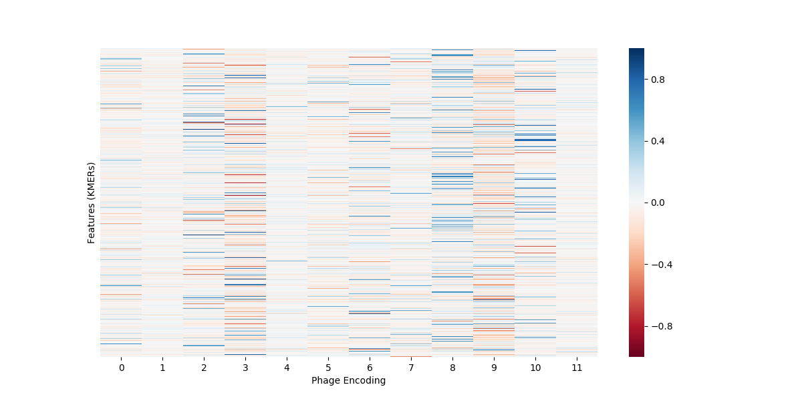
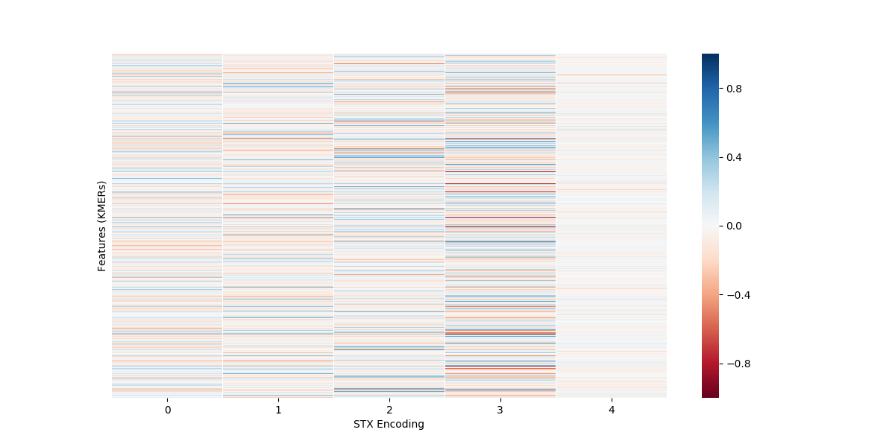
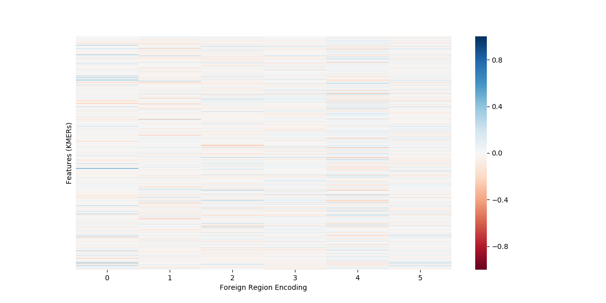
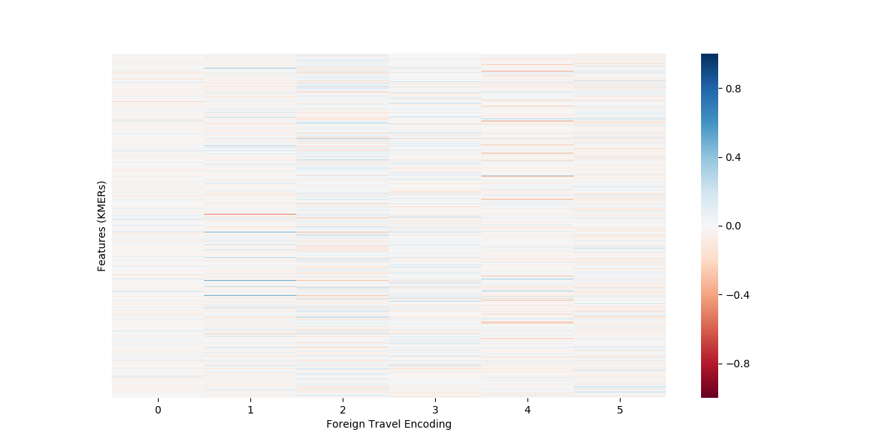
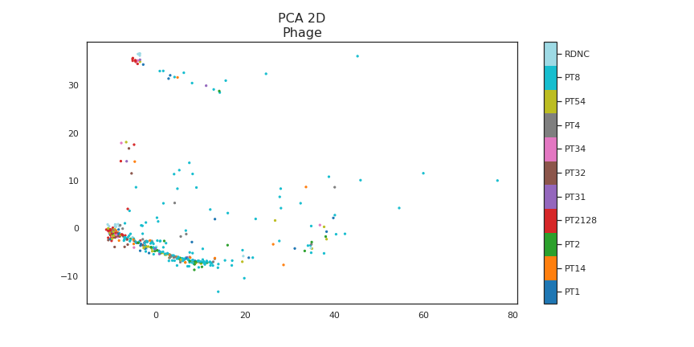
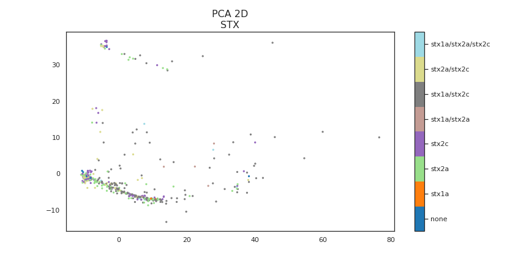
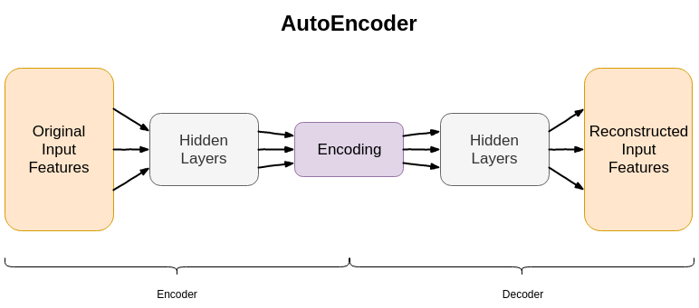
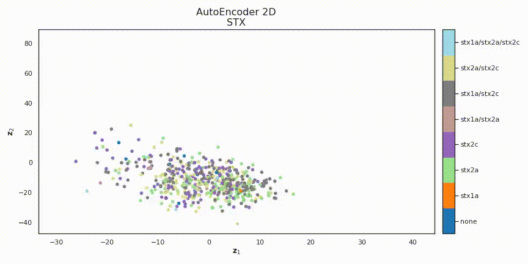
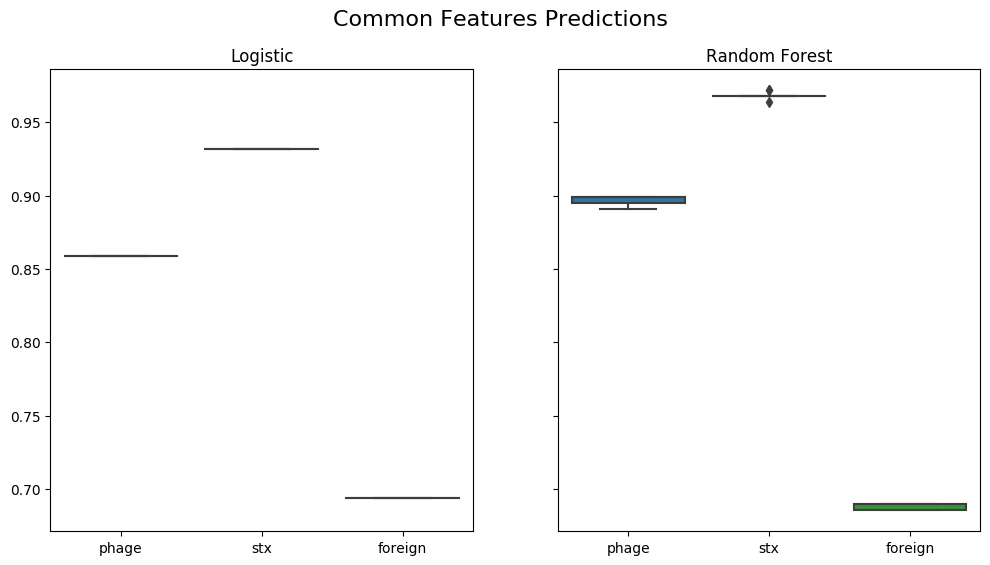
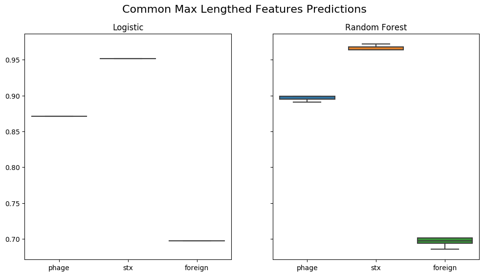

# Public Results of TFR: Meta-Data Prediction with DNA Sequences

This documentation aims to show some findings over the summer of 2019 collaborating between the University of Bath's SAMBa and Department of Biology & Biochemistry. The objective is to classify various meta-information given the counts of a large number of KMERs i.e. a single count could be for how many times 'TTTAGC' appeared in a read of DNA.

## Data

The presented can be broken down into two different sets; counts of KMERs and target classifications for *phage* and *stx* types along with *foreign travel* and *foreign region* locataions. The data provided is largely skewed towards the UK as the data is provided from a UK source.

### Correlations

#### Phage Type

#### STX Type

#### Foreign Region

#### Foreign Travel

### Clustering (Linear)

Princple Component Analysis (PCA) is a great tool to cluster data together on the assumption the data has linear relationships. When carried out with respect to phage and stx types we yield:

where state references stx as at the time, stx was labelled state.

  

According to the above cross-correlation plots and PCA dimensionality reduction visualisations between the KMERs and the meta-data classifications, we see that for the most, the ***linear*** relationships are weak.
This motivates the use of non-linear methods, a lot of which sit in the **machine learning** community.

## Machine Learning

### Autoencoder

The Autoencoder is a a 2-part neural network. The first part, the encoder, attempts to reduce our data and the second part, the decoder, attempts to restore the reduced data back to the original. A simple analogy is to
consider the zip compression on your computer. The actions of zipping content is similar to that of the encoder and likewise, unzipping content is similar to the decoder. To understand how the neural network learns,
you will need to know the *chain rule* and some mathematical notation where [this link](https://skymind.ai/wiki/neural-network) explains it.

Since the dataset is huge i.e. a single observation could have millions of KMERs, reducing that many numbers to 2 or 3 numbers seem near impossible to do! The below visualisations have attempted to map only the first
999 KMERs into 2 and 3 dimensions. At the time of originally carrying out this experiment, the main objectives were to classify phage and stx types only hence, foreign region / travel visualisations are missing. The 2D visualisations show clustering over training iterations (it learns over 5000 steps) whilst the 3D show final learnt embedding.

#### Phage

#### STX

### Random Forest

For a quick intro to how Decision Trees and Random Forest works, try [this link](https://jakevdp.github.io/PythonDataScienceHandbook/05.08-random-forests.html). If you already know how it works, then we know that
it finds a series of queries like *is feature1 > 5* that correctly classifies some observation with lots of features. To compare the performance of the standard logistic (linear) model and the random forest, below
are boxplots for phage and stx types along with foreign region only. The experiment was done 10 times for the complete dataset with different element of randomness each time. Only common KMERs between the 2017 and 2018 datasets were considered with the first set of plots using all common KMERs and the second set with only the common KMERs of length 100.

  

